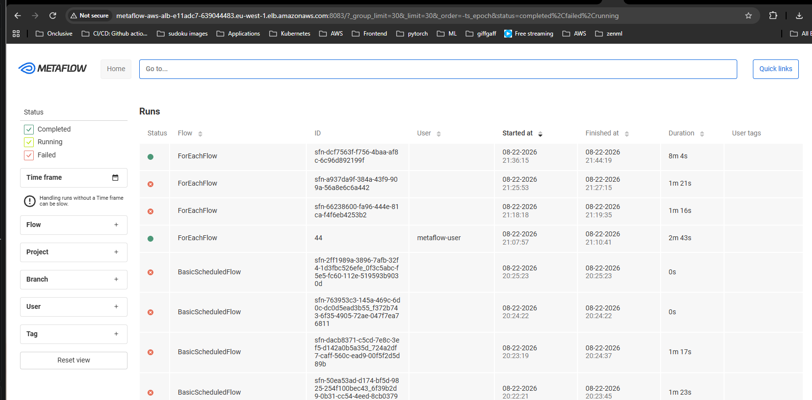
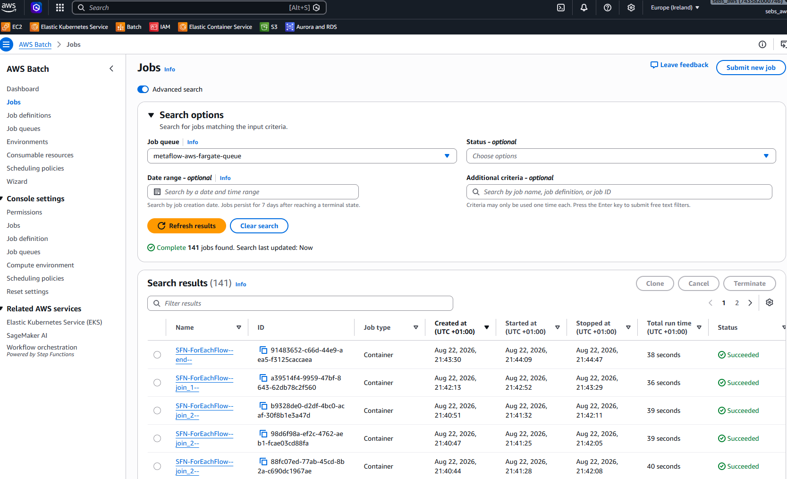
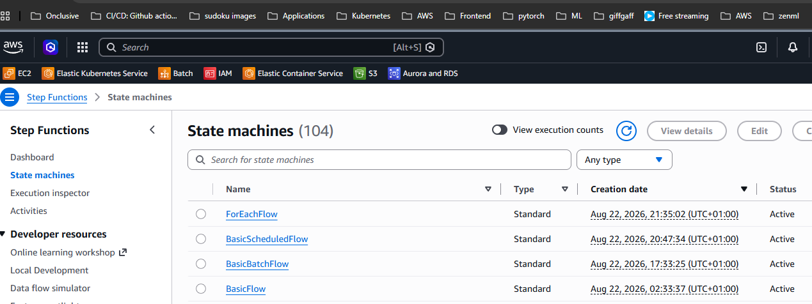
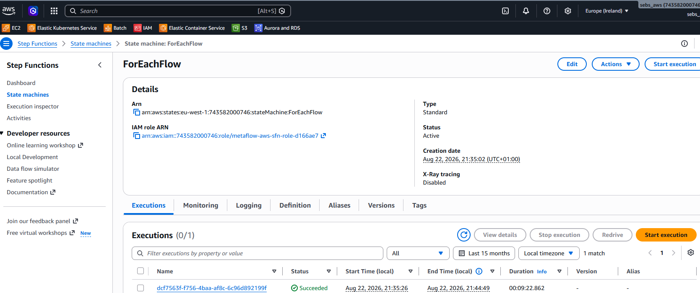
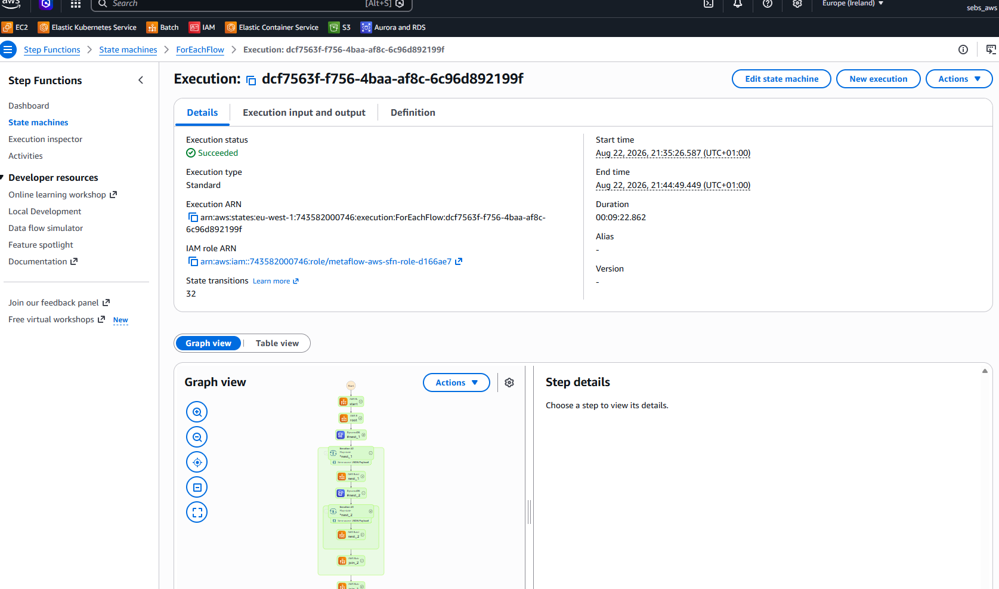

# Metaflow on AWS — Pulumi (Python)

This repository contains the pulumi code to provision an AWS Batch and Stepfunctions
backed metaflow stack on AWS, and some test flows to validate said infrastructure.

## Setup

Use the included devcontainer specs to spin up the devcontainer in VS Code.

As seen in the `.devcontainer/devcontainer.json` configuration, it relies on an
 AWS profile called `pulumi`, and a credentials file linked to said profile:

 ```json
 ...
   "remoteEnv": {
    "AWS_PROFILE": "pulumi",
    "AWS_REGION": "eu-west-1",
    "AWS_PAGER": "",
    "USERNAME": "metaflow-user"
  },
  "mounts": [
    "source=${localEnv:USERPROFILE}/.aws,target=/root/.aws,type=bind",
    "source=.metaflowconfig,target=/root/.metaflowconfig,type=bind"
  ],
...
```

## Infrastructure

Change into the `infrastructure` directory. This stack deploys:

- **VPC** — 2 AZs, public + private subnets, single NAT gateway
- **RDS Postgres** — backing DB for the metadata service
- **S3 bucket** — Metaflow datastore
- **Cloud Map private DNS namespace** (`metaflow.local`) — stable internal
  addresses for the metadata service and UI backend, used by Batch job
  containers and the UI backend's calls to the metadata service. Always
  present, regardless of ALB mode below.
- **ECS Fargate: metadata + migration service** — registered in Cloud Map
  (`metadata-service.metaflow.local:8080`), plus either an ALB listener or a
  direct public IP depending on `metaflow:useLoadBalancer` (see below)
- **ECS Fargate: UI** — backend + static frontend, same ALB-or-direct-IP
  choice, sharing the same load balancer as the metadata service when one
  is deployed
- **AWS Batch** - compute layer, including E2 backed queues with GPU support
- **Stepfunctions** - the required IAM setup to tap into the step-functions orchestrator
  backend for metaflow

To deploy it, run

```bash
pulumi up
```

Then run

```bash
pulumi stack output metaflow_config --json > ../.metaflowconfig/config.json
export METAFLOW_HOME=/workspace/.metaflowconfig
```

to generate the metaflow config file. It will have the correct AWS references
to point your local metaflow client to the AWS cloud resources you just 
provisioned.

To connect to the metaflow UI exposed through the alb, retrieve its external url
from the stack outputs:

```bash
pulumi stack output ui_external_url
# e.g. http://metaflow-aws-alb-e11adc7-639044483.eu-west-1.elb.amazonaws.com:8080
```

You should see something like this, minus the flows:



## Test

Change into the `flows` directory.

To test the infrastructure, you can run these flows
- locally, 
- against AWS Batch using `--with batch` or 
- by deploying to AWs Stepfunctions first and triggering them remotely.

See [here for details on batch](https://docs.metaflow.org/scaling/remote-tasks/aws-batch), and here for [details on stepfunctions](https://docs.metaflow.org/production/scheduling-metaflow-flows/scheduling-with-aws-step-functions).

Each step executed on batch - either from local or as part of a stepfunctions
execution - should result in (at least) one AWS Batch job:



Each `... step-functions create` invocation should create a state machine
definition (version):



And each `... step-functions trigger` invocation (or scheduled triggers of 
state machine definitions) should create a state machine execution:



Each execution can be inspected in detail:

