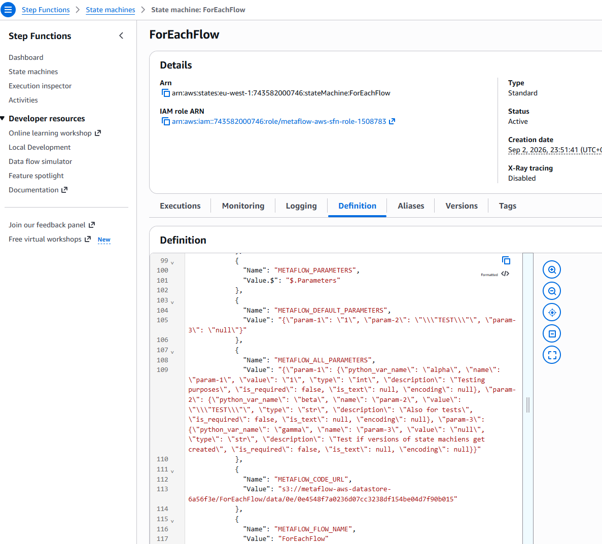
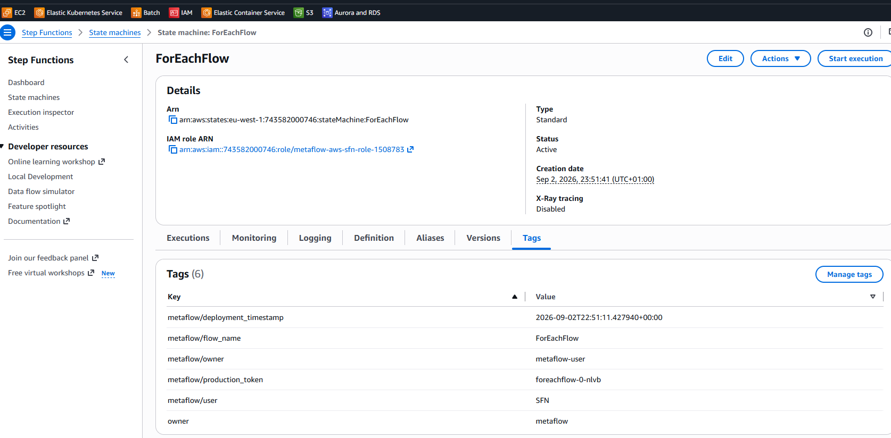

# Metaflow on AWS — Pulumi (Python)

This repository includes a `step-function` plugin that implements the 
`from_deployment` pattern currently only supported by the `argo` backend. It 
supports the creation of flows from remote state machine deployments, removing
 the need for referencing the flow `.py` module before invoking the flow to
 create a new run:

```bash
>>> # create a deployment as usual referencing the flow .py file
>>> from metaflow import Deployer
>>> deployed_flow = Deployer('nested_each_flow.py').step_functions().create()
Metaflow 2.19.38 executing ForEachFlow for user:metaflow-user
Validating your flow...
    The graph looks good!
Running pylint...
    Pylint not found, so extra checks are disabled.
Deploying ForEachFlow to AWS Step Functions...
It seems this is the first time you are deploying ForEachFlow to AWS Step Functions.

A new production token generated.

The namespace of this production flow is
    production:foreachflow-0-nlvb
To analyze results of this production flow add this line in your notebooks:
    namespace("production:foreachflow-0-nlvb")
If you want to authorize other people to deploy new versions of this flow to AWS Step Functions, they need to call
    step-functions create --authorize foreachflow-0-nlvb
when deploying this flow to AWS Step Functions for the first time.
See "Organizing Results" at https://docs.metaflow.org/ for more information about production tokens.

State Machine ForEachFlow for flow ForEachFlow pushed to AWS Step Functions successfully.

What will trigger execution of the workflow:
    No triggers defined. You need to launch this workflow manually.
>>> # re-create a second deployed flow, referencing only the remote deployment
>>> deployed_flow = DeployedFlow.from_deployment('arn:aws:states:eu-west-1:743582000746:stateMachine:ForEachFlow')
>>> deployed_flow.trigger(param_1=2)
Metaflow 2.19.38 executing ForEachFlow for user:metaflow-user
Validating your flow...
    The graph looks good!
Running pylint...
    Pylint not found, so extra checks are disabled.
Workflow ForEachFlow triggered on AWS Step Functions (run-id sfn-bd1ac153-a02d-484e-9701-437b61e1f43b).
<metaflow_extensions.metaflow_aws.plugins.aws.step_functions.step_functions_deployer_objects.CustomStepFunctionsTriggeredRun object at 0x7bf537aab110>
>>> deployed_flow.list_runs()
[<metaflow_extensions.metaflow_aws.plugins.aws.step_functions.step_functions_deployer_objects.CustomStepFunctionsTriggeredRun object at 0x7bf5351bb820>]
>>> deployed_flow.list_runs(states=['RUNNING'])
[<metaflow_extensions.metaflow_aws.plugins.aws.step_functions.step_functions_deployer_objects.CustomStepFunctionsTriggeredRun object at 0x7bf53518e7b0>]
```





It also contains the pulumi code to provision an AWS Batch and Stepfunctions
backed metaflow stack on AWS, and some test flows to validate said infrastructure.

## Setup

Use the included devcontainer specs to spin up the devcontainer in VS Code.

As seen in the `.devcontainer/devcontainer.json` configuration, it relies on an
 AWS profile called `pulumi`, and a credentials file linked to said profile:

 ```json
 ...
   "remoteEnv": {
    "AWS_PROFILE": "pulumi",
    "AWS_REGION": "eu-west-1",
    "AWS_PAGER": "",
    "USERNAME": "metaflow-user"
  },
  "mounts": [
    "source=${localEnv:USERPROFILE}/.aws,target=/root/.aws,type=bind",
    "source=.metaflowconfig,target=/root/.metaflowconfig,type=bind"
  ],
...
```

Change into the top level directory. To create a uv-managed virtual environment
 with `python=3.14`, run

```bash
uv venv --python=3.14
```

To activate the virtual environment, run

```bash
source .venv/bin/activate
```

To build the metaflow-aws extension, run:

```bash
uv build
```

To sync the activate virtual environment, run:

```bash
uv sync
```

## Infrastructure

Change into the `infrastructure` directory. This stack deploys:

- **VPC** — 2 AZs, public + private subnets, single NAT gateway
- **RDS Postgres** — backing DB for the metadata service
- **S3 bucket** — Metaflow datastore
- **Cloud Map private DNS namespace** (`metaflow.local`) — stable internal
  addresses for the metadata service and UI backend, used by Batch job
  containers and the UI backend's calls to the metadata service. Always
  present, regardless of ALB mode below.
- **ECS Fargate: metadata + migration service** — registered in Cloud Map
  (`metadata-service.metaflow.local:8080`), plus either an ALB listener or a
  direct public IP depending on `metaflow:useLoadBalancer` (see below)
- **ECS Fargate: UI** — backend + static frontend, same ALB-or-direct-IP
  choice, sharing the same load balancer as the metadata service when one
  is deployed
- **AWS Batch** - compute layer, including E2 backed queues with GPU support
- **Stepfunctions** - the required IAM setup to tap into the step-functions orchestrator
  backend for metaflow

To deploy it, run

```bash
pulumi up
```

Then run

```bash
pulumi stack output metaflow_config --json > ../../root/.metaflowconfig/config.json
```

to generate the metaflow config file and export it to the container's 
home directory. It will configure your local metaflow client to point to the
 AWS resources you just provisioned.

To connect to the metaflow UI exposed through the alb, retrieve its external url
from the stack outputs:

```bash
pulumi stack output ui_external_url
# e.g. http://metaflow-aws-alb-e11adc7-639044483.eu-west-1.elb.amazonaws.com:8080
```

You should see something like this, minus the flows:


## Test

Change into the `flows` directory. To tell metaflow to use the `step-functions`
backend as the default implementation when using the 
`DeployedFlow.from_deployment` method, run

```bash
export METAFLOW_DEFAULT_FROM_DEPLOYMENT_IMPL=step-functions
```

To test the infrastructure, you can run these flows
- locally, 
- against AWS Batch using `--with batch` or 
- by deploying to AWs Stepfunctions first and triggering them remotely.

See [here for details on batch](https://docs.metaflow.org/scaling/remote-tasks/aws-batch), and here for [details on stepfunctions](https://docs.metaflow.org/production/scheduling-metaflow-flows/scheduling-with-aws-step-functions).

Each step executed on batch - either from local or as part of a stepfunctions
execution - should result in (at least) one AWS Batch job:


Each `... step-functions create` invocation should create a state machine
definition (version):


And each `... step-functions trigger` invocation (or scheduled triggers of 
state machine definitions) should create a state machine execution:


Each execution can be inspected in detail:

